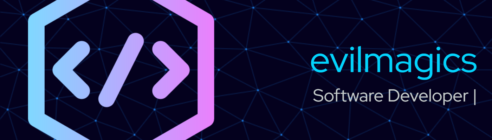

    

<h3 align="center">Come On in—I’ve Been Waiting for You!</h3>

    
    
    

###
---
###

### 🧑🏻‍💻 Who'm I?

I'm a passionate software engineer with a deep love for building innovative solutions. My experience spans from web development to mobile applications, and I'm always eager to learn new technologies.

*Currently, I'm focused on developing robust applications using modern technologies while maintaining clean code practices and following industry best practices.*

###

### ⚔️ Languages

    
    
    
    
    
    
    
    
    
    

### 📚 Frameworks and Libraries

    
    
    
    
    
    
    
    

### 🧰 Tools

    
    
    
    
    
    
    
    
    
    
    
    
    
    
    
    
    
    
    
    
    
    
    
    
    
    

###

    

        
        
    

    

        
    

    

        
    

    

        
    

